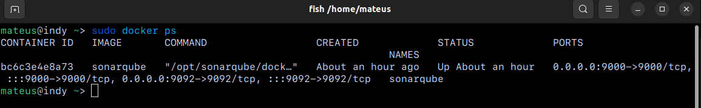
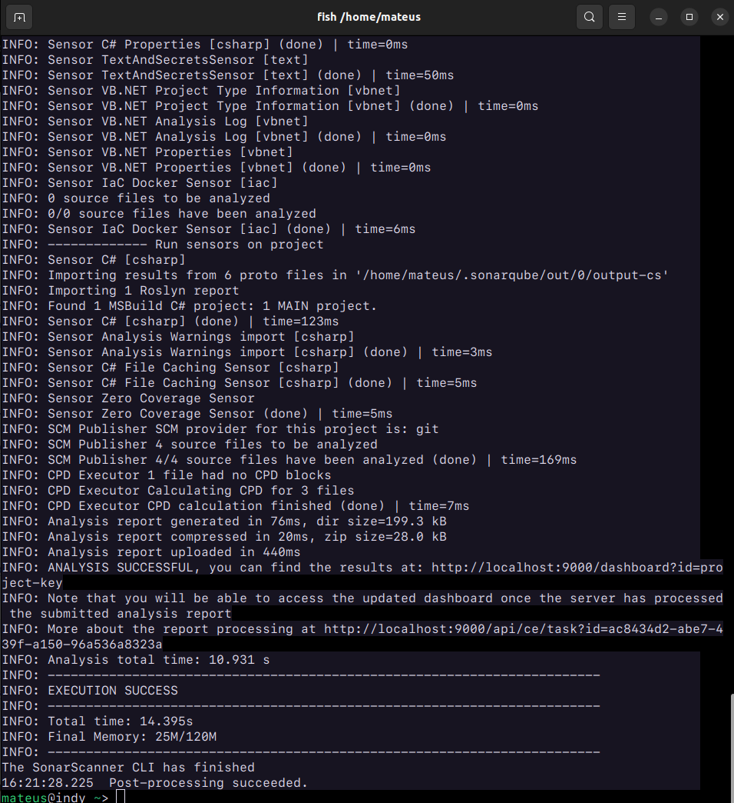
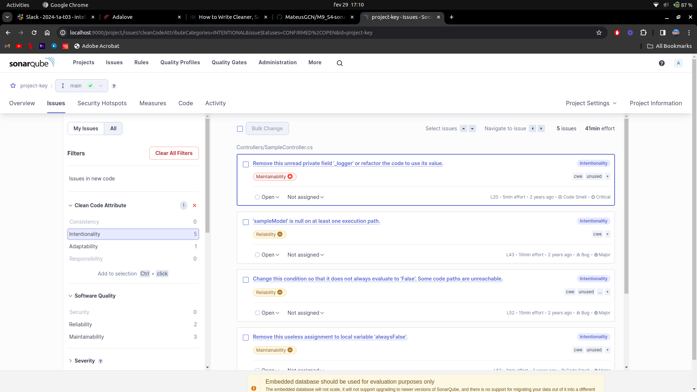

# M9_S4-sonarqube

Durante essa atividade, foi realizada a análise de um código em .NET utilizando a ferramenta SonarQube. As tecnologias empregadas nessa atividade incluíram o .NET, linguagem na qual o projeto analisado foi escrito, o Docker que foi utilizado para a execução e configuração do SonarQube e o próprio SonarQube, uma ferramenta que realiza a análise completa do código, indicando erros, falhas de segurança e outras vulnerabilidades. Além de apontar o motivo do erro, o SonarQube também estima o tempo necessário para a correção do problema. Com essa análise, foi possível compreender a importância da identificação de problemas utilizando uma ferramenta que mapeia todo o código, como o SonarQube.

Docker rodando o SonarQube:

Configuração do SonarQube para análise do projeto:

Interface do SonarQube com os resultados da análise:

